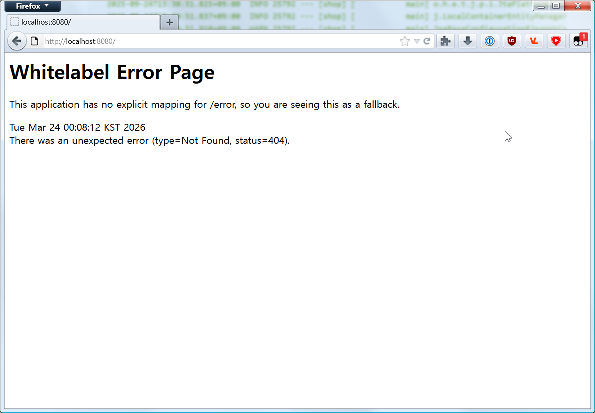

# What I Learned
## 강의 요약
* 앞에 아는거 생략
* HTTP 메서드
    * GET (불러오기), POST (새로만들기), PUT/PATCH (수정)
* HTTP 응답코드
    * 200 (OK), 201 (요청 결과 만들어졌다), 400 (요청이 잘못됐다), 404 (그런거 없다), 500 (서버측 오류)
* 매번 HTML 전체를 보내주면 서버에 부하가 많이가기 때문에 요즘은 백엔드에서 내용만 보내주고 프론트엔트 뼈대는 재사용한다. -> 클라이언트 사이드 렌더링
* 프론트엔드: 사용자가 직접 보고 상호작용하는 화면, UI 개발
* 백엔드: 사용자의 요청 받아 실제 동작 처리하고 데이터 저장/관리
* 데이터베이스 (DB): 서버가 다루는 방대한 데이터를 영구적으로, 안전하게, 효율적으로 보관
    * 데이터를 체계적으로 모아둔 저장소
    * DBMS로 DB를 관리, 조작 (중복 해결, 독립성 확보, 무결성 유지...)
    * MySQL, PostgreSQL, MongoDB 등
* API (Application Programming Interface)
    * 한 프로그램이 다른 프로그램의 기능이나 데이터를 사용할 수 있도록 미리 정해놓은 약속(규칙)이자 소통 창구
    * 클라이언트와 서버가 소통할때 어떻게 요청을 보내고 어떻게 응답할지 등을 정해놓은 규칙과 기능의 목록
* REST (Representational State Transfer)
    * 네트워크 아키텍처 스타일, HTTP 장점을 최대로 활용함
* REST 구성요소
    * 자원 (Resource) - URI
    * 행위 (Verb) - HTTP Method
    * 표현 (Representation) - JSON이 일반적
* Spring
    * Java 엔터프라이즈 애플리케이션 개발에 사용되는 오픈소스 경량급 애플리케이션 프레임워크
    * Java 언어의 가장 큰 특징인 객체 지향을 잘 살려냄
    * Java로 백엔드 애플리케이션을 빠르고 안정적으로 만들 수 있도록 기본 구조와 규칙을 제공하는 툴
* Spring Boot
    * 복잡한 초기 설정 없어도 스프링 프레임워크를 아주 빠르고 쉽게 사용할 수 있게 해주는 도구
## 온라인 쇼핑몰 프로젝트 API 명세서
### 상품 기능
* 상품 정보 등록
    * `POST /items`
* 상품 목록 조회
    * `GET /items`
* 개별 상품 정보 상세 조회
    * `GET /items/{itemId}`
* 상품 정보 수정
    * `PATCH /items/{itemId}`
* 상품 삭제
    * `DELETE /items/{itemId}`
### 주문 기능
* 주문 정보 생성
    * `POST /order`
* 주문 목록 조회
    * `GET /order`
* 개별 주문 정보 상세 조회
    * `GET /order/{orderId}`
* 주문 취소
    * `DELETE /order/{orderId}`
## Spring 개발 환경 세팅
* JDK 17 설치
    * 그냥 [링크해준 블로그](https://yungenie.tistory.com/11) 따라하면 된다.
    * %PATH%는 exe로 설치하니 자동으로 등록되더라.
* IntelliJ 설치
    * 학생 인증은 이미 인증해둔 GitHub Education으로 인증하니까 간단하다.
    * 인증한 후 메뉴 뒤져서 IntelliJ Ultimate 다운받고 깔면 된다
    * Trial이라 뜨면 로그인하고 학생 라이선스 Activate해라.
* Sprint Initializr
    * 왼쪽 메뉴 항목이랑 버전이 좀 달라졌는데 별 상관 없는 것 같다.

