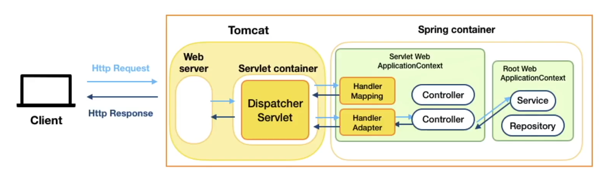
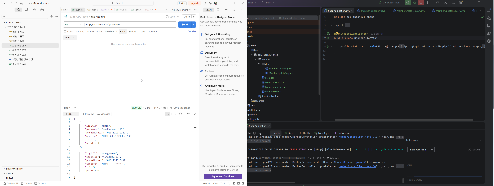

# What I Learned
## 스프링 계층형 아키텍처 (Layered Architecture)
```
|Browser| <- DTO -> |Controller| <- DTO -> |Service| <- DTO -> |DAO| <- Entity (Domain) -> | DB|
```
* Browser: Frontend
* Controller (컨트롤러 계층)
    * Browser와 HTTP로 소통
    * 특정 endpoint(URL)로 요청을 가장 먼저 처리
    * 비즈니스 로직은 모르므로 DTO를 사용하여 서비스 계층과 데이터 주고받음
* Service (서비스 계층)
    * 뭐 해야하는지 다 아는데 데이터는 없음
    * DAO한테 데이터 요청
* DAO / Repository
    * 데이터 관리
* DB: 데이터 저장소
* DTO: 데이터 전송 객체 (Data Transfer Object)
    * 소통 목적에 맞는, 필요한 정보만 전달
* Entity
    * DB 테이블과 맵핑되는 핵심 객체
    * 외부 직접 노출 금지 (데이터 일관성/보안 위해)
## 컨트롤러 만들기
1. @Controller 어노테이션
2. @ResponseBody 어노테이션
3. @RestController 어노테이션
4. 생성자 주입 (서비스 계층에 의존)
5. @RequestMapping을 통해 method, url 지정
6. 공통 URL & 상세 URL
7. RequestBody를 통해 json 데이터 받아오기
## 패키지 구조
* 계층형 구조
    * 애플리케이션을 기능별로 나눔
    * Controller -> controller, Service -> service...
* 도메인형 구조
    * 특정 도메인 관련 모든 클래스를 한 곳에 놓아서 코드 탐색이 쉬움
    * 도메인 단위로 개발하여 유지보수가 용이함
    * 새 도메인 추가 시 다른 곳에 영향이 없음
    * 이번에 사용할 구조
## 스프링 애플리케이션 구조
* 스프링 애플리케이션 구조

* Spring Container
    * = 스프링 빈 저장소
    * = 어플리케이션 컨텍스트
* 스프링 빈 (Spring Bean)
    * 앱 전역에서 사용할 공용 객체
    * 스프링 컨테이너(공용 창고)에 빈을 저장, 필요한 빈을 컨테이너에서 받아 사용
    * 필요한 빈은 스프링 프레임워크가 자동으로 가져다줌
    * 빈을 요구하는 객체도 스프링 빈
* 빈 등록 방법
    * 수동: 설정 파일 작성
    * 자동: 컴포넌트 스캔
    * @ComponentScan: 어떤 클래스들이 Spring Bean인지 찾아서 등록 (@SpringBootApplication에 포함)
    * @Component: 빈으로 등록하고 싶은 클래스에 붙여서 이 클래스가 빈이라고 표시 (@Controller, @Service, @Repository, @Entity등에 포함)
* 의존성 주입 (Dependency Injection; DI)
    * 내가 의존하지 않는 객체를 직접 생성하지 않고 밖(스프링)에서 주입받는 것
    * 메모리 효율적으로 사용하기 위해 사용
* 의존성 주입 방법 - 생성자 주입
    1. 안전하게 final로 선언 (변수에 한번만 값 할당 가능)
    2. 생성자에 @Autowired를 사용하면 생성자를 통해 빈 주입
    3. 생성자가 하나만 있으면 @Autowired 생략 가능
    * @Autowired 생성자는 @RequiredArgsConstructor로 대체 가능
## Postman 사용
