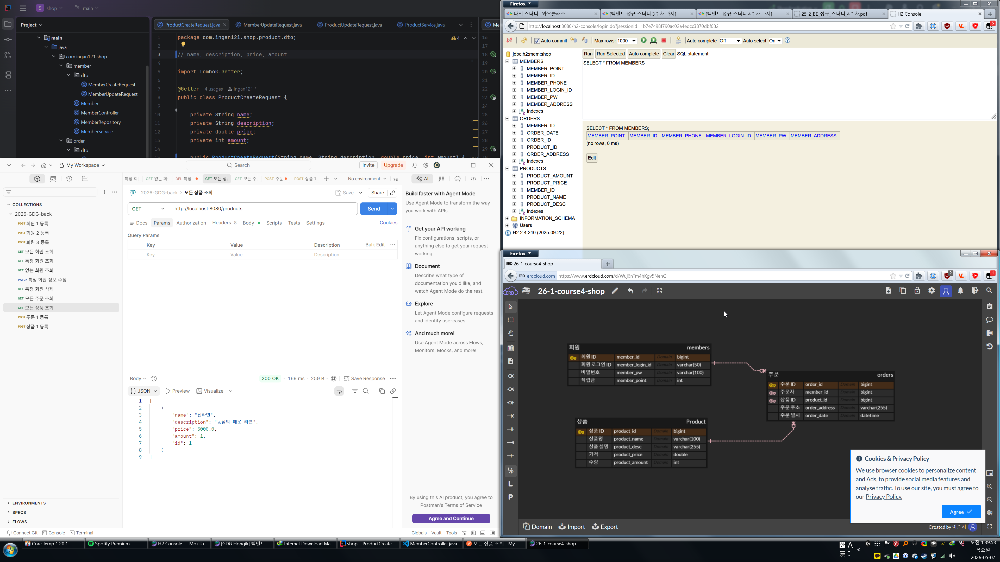
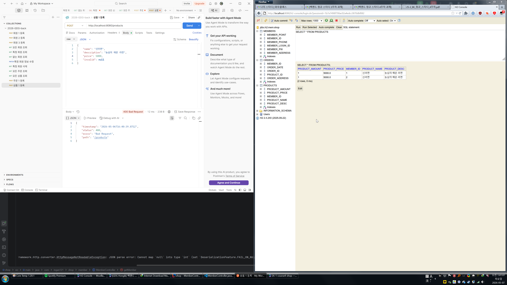

# What I Learned
## ERD (Entity-RelationShip Diagram)
* ERD = 데이터 청사진(blueprint)
* DB 설계할 때 쓰는거
* 중요한 개념들:
    * Entity(개체): 데이터를 가진 대상
    * Relation(관계): 개체 사이의 연관성
* 개체-관계 중심의 모델링 기법: ER Model (Entity-Relationship Model)
* ER Model을 시각적으로 표현한 그림이 ERD
## DB 설계
* 핵심 용어:
1. 엔티티 (Entity): 관리해야 할 데이터의 주체
    * 예: 회원, 상품, 주문
2. 속성 (Attribute): 각 엔티티가 가지는 구체적 정보. 필드/칼럼이라고도 함
    * 예: Member - id, name, address; Product - name, price, stock
3. 기본 키 (Primary Key/PK): 고유하게 실별하는 데 사용되는 하나 이상의 칼럼(필드)
    * 예: member_id, product_id, order_id
4. 외래 키 (Foreign Key/FK): 다른 테이블의 PK를 참조(저장)하는 속성(칼럼); "테이블 간 연결고리"
    * 예: 100번 주문을 누가 했는지 알고자 할때 Order 테이블 안에 member_id를 저장. member_id가 FK
5. 관계 (relation): 개체 사이의 연관성, 업무 규칙. 테이블 또는 외래 키로 구현
    * 다대일/일대다*/일대일/다대다*
* 일대다 (1:N)
    * 한명의 회원은 여러 개의 주문 내역을 가진다 -> member와 order관계는 1:N
    * Order테이블은 member_id를 FK로 가짐 -> "FK로 관계를 구현한다"
* 다대다 (N:M)
    * Student - Course
    * 한 명의 학생은 여러 개의 강의를 수강할 수 있고, 한 개의 강의는 여러 명의 학생이 수강할 수 있다.
    * FK로 해결 불가능. 학생 한명당 하나의 강의만, 강의 하나당 학생 한명밖에 못들음
    * 해결책: 중간 테이블 (연결 엔티티) 도입
    * 예: Enrollment (수강신청) 테이블에 enrollment_id (PK), student_id (FK), course_id (FK), (추가속성) grade 등등
    * "테이블로 관계를 구현한다"
* 식별 관계 vs 비식별 관계
    * 식별: 강한 연관 관계. 관계 대상의 PK를 자신의 PK로도 사용
    * 비식별: 느슨한 연관관계. 관계 대상의 PK를 자신의 FK로만 사용
    * 보통 비식별 선택
## 스크린샷들

